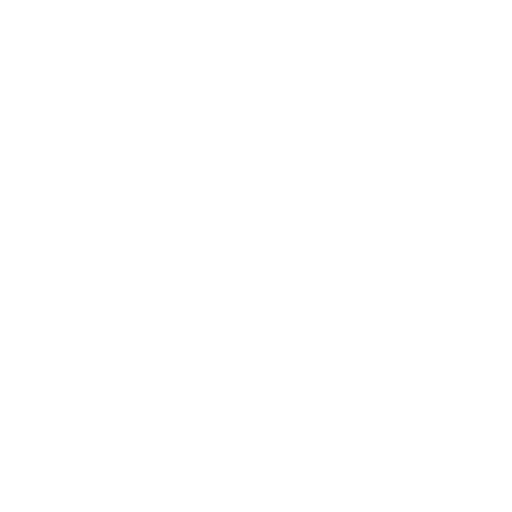
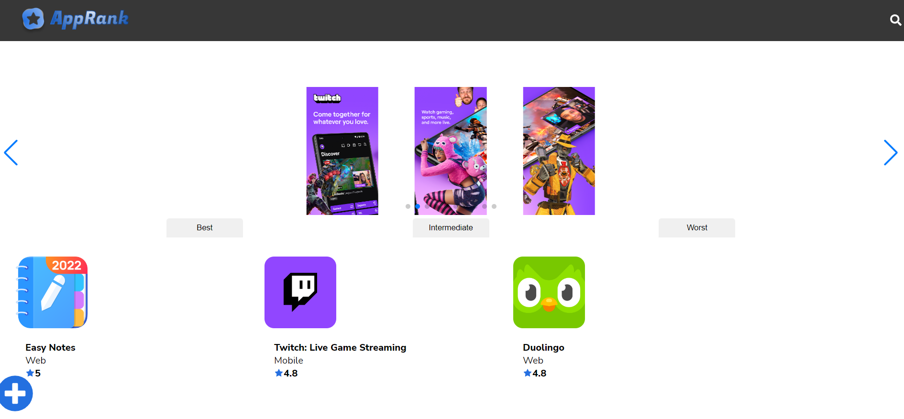
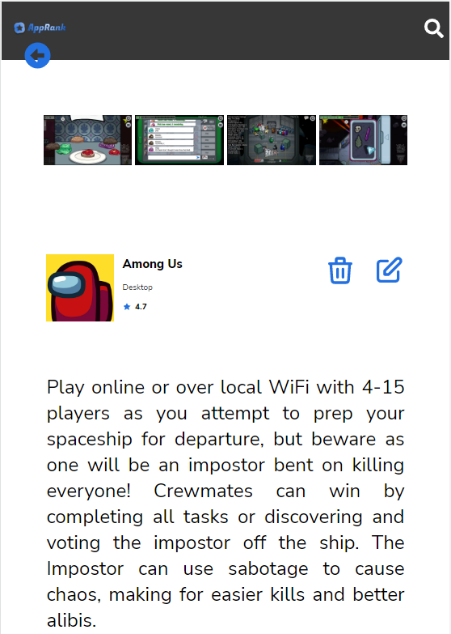
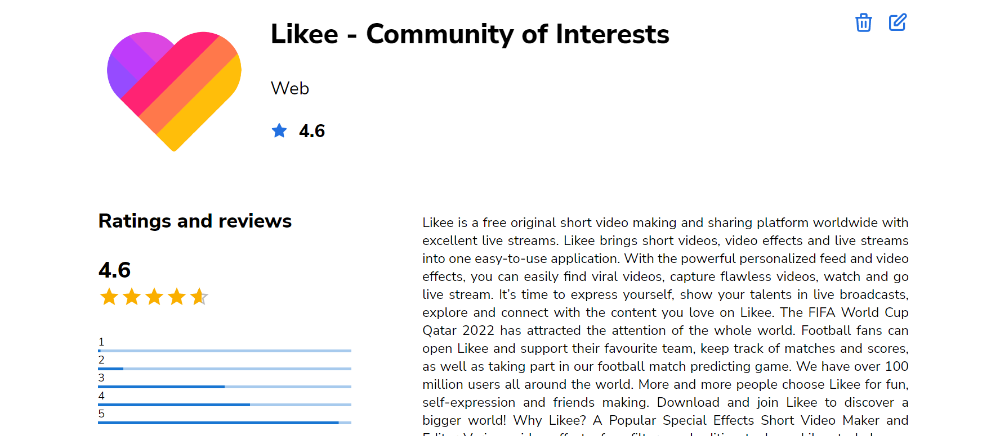
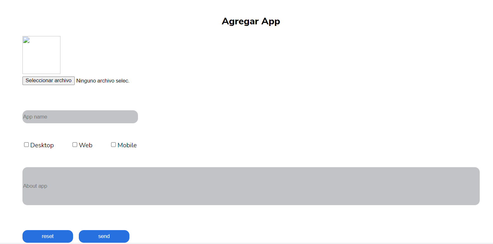

# AppRank



## Table of Contents
- [AppRank](#apprank)
  - [Table of Contents](#table-of-contents)
  - [General Information](#general-information)
  - [Screenshots](#screenshots)
  - [Technologies](#technologies)
  - [Deployment](#deployment)
  - [Support](#support)
  - [Collaboration](#collaboration)
  - [Authors](#authors)
  - [FAQs](#faqs)

***
## General Information
AppRank is an app designed by the UX/UI International Comission with the purpose of allowing users to rank applications.  

The app allow users to find, map, review and rank all apps on the market.
 

***

## Screenshots


***

***


***


***
## Technologies
The project was developed with the following technologies
* HTML5
* JavaScript
* Node Js
* React
* react-router DOM
* react icons
* Styled-components
* Npm
* MUI materials


***
## Deployment

  
https://ranking-app-xo4j.vercel.app/git


***


## Support

To handle any enquiries contact
>andres.patino@factoriaf5.org

***


## Collaboration
The project is open to user contributions. If you wish to contribute you should contact:

> andres.patino@factoriaf5.org
***
## Authors

[Alejandra Morales Cuitiño](https://github.com/AleMCuitino)  
[Albert Arqués](https://github.com/albertarques)   
[Alejandra Jaramillo](https://github.com/AlexandraJaramillo)  
[Eberth Isaac Castro](https://github.com/EberthCastro)  
[Isabel Castro](https://github.com/Behbiz)   
[federico gatti](https://github.com/fcegatti)


***
## FAQs

1. **Can I rank Apps for all devices?**

Apps can be ranked either for Windows, Android or Mac iOS.

2. **Can I rank my own App?**

Anyone can upload your app to our database and every user is able to rank it. In future versions of AppRank you will be able to create a user account and manage your app information.

3. **Can I download apps from AppRank?**

As of now AppRank is merely an informative database. Future versions of our App may feature download options.

4. **Does AppRank have a premium version?**

AppRank does not have any premium services. You can use all of our features completely free.


 ``` 
 


